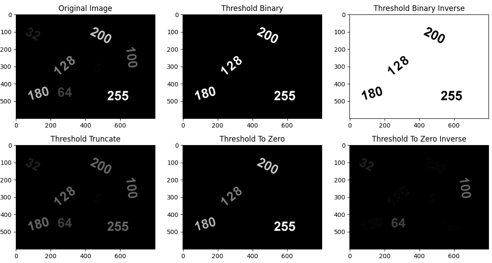
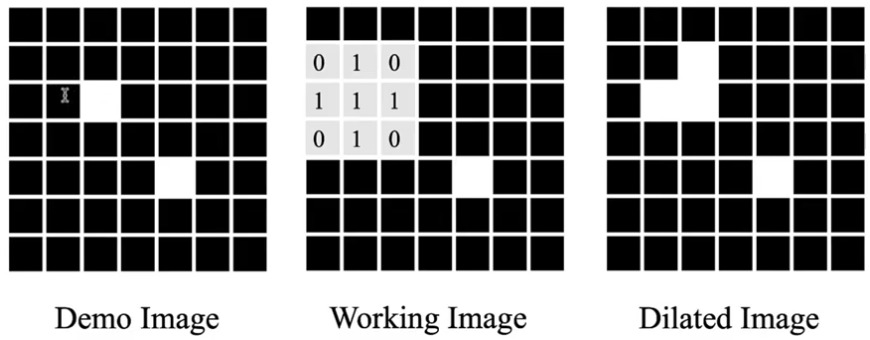

# binary image processing
* threshold operation: convert grayscale image to binary
* erosion and dilation operation: shrink or expand binary blobs
    * useful for removing noise from binary images
* contour analysis
* threshold

* erosion, dilation (method 2)

